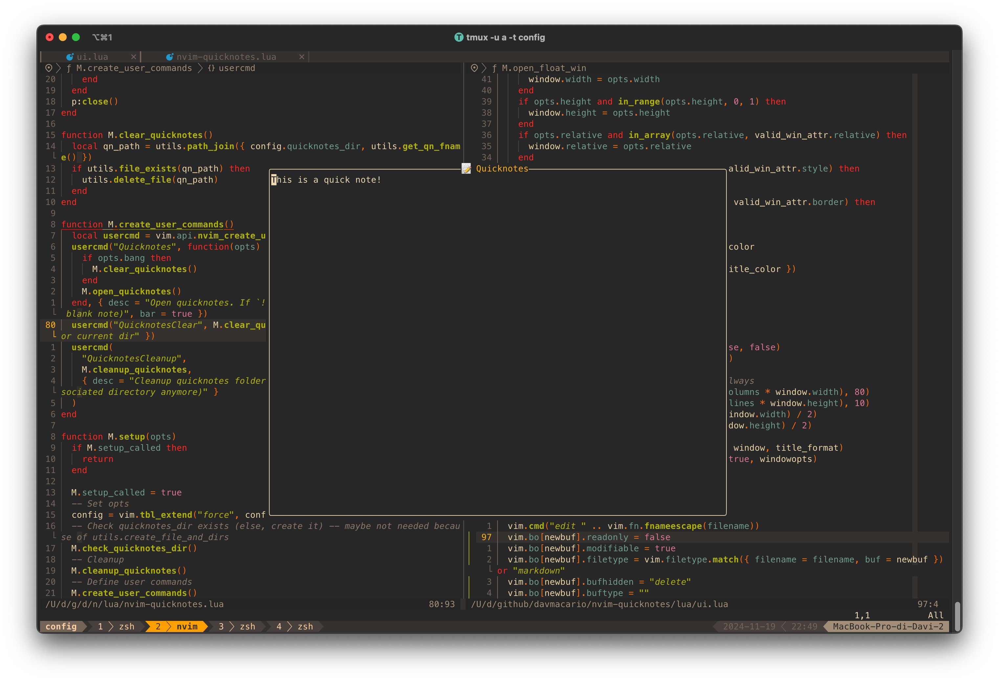

# 📝 nvim-quicknotes

Quicknotes plugin for Neovim.



Create a Quicknote in a floating window, and save it on your computer to be picked up later.
The Quicknote supports Markdown format.

## Installation

### Lazy

```lua
{
  "davmacario/nvim-quicknotes",
  cmd = { "Quicknotes", "QuicknotesClear", "QuicknotesCleanup" }, -- Lazy-load the plugin
  config = function()
    require("nvim-quicknotes").setup()

    -- Custom keymap
    vim.keymap.set("n", "<leader>qn", vim.cmd.Quicknotes, { desc = "Open quicknotes" })
  end,
}
```

## Configuration

The following are the default configuration settings for the plugin:

```lua
require("nvim-quicknotes").setup({
  -- Local directory where all the quicknotes will be stored
  quicknotes_dir = utils.path_join({ os.getenv("HOME"), ".local/state/nvim/quicknotes/" }),
  window = {
    width = 0.5,
    height = 0.6,
    relative = "editor",
    style = "minimal",
    border = "rounded",
})
```

The notes are stored in `quicknotes_dir`.
For a quicknote opened in `/path/to/project`, the quicknote name will be `path%to%project%quicknotes.md`.

## Usage

- `:Quicknotes`: open quicknote for current project (create it if absent). Press `q` in _normal_ mode to save the note and close the floating window.
- `:QuicknotesClear`: delete the quicknote associated with current directory.
- `:QuicknotesCleanup`: cleanup the quicknotes directory - delete the quicknotes associated with directories that are not anymore on the current system or _any file not following the naming scheme_ inside `quicknotes_dir`.

## License

[MIT](./LICENSE)
